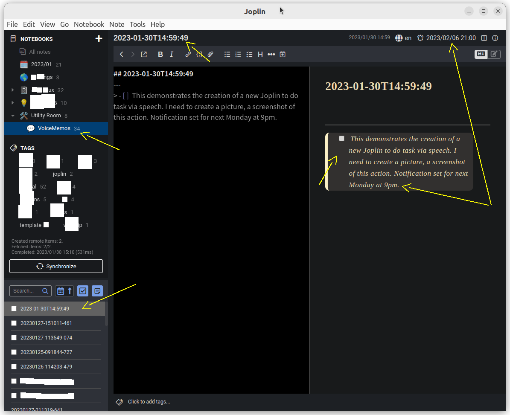
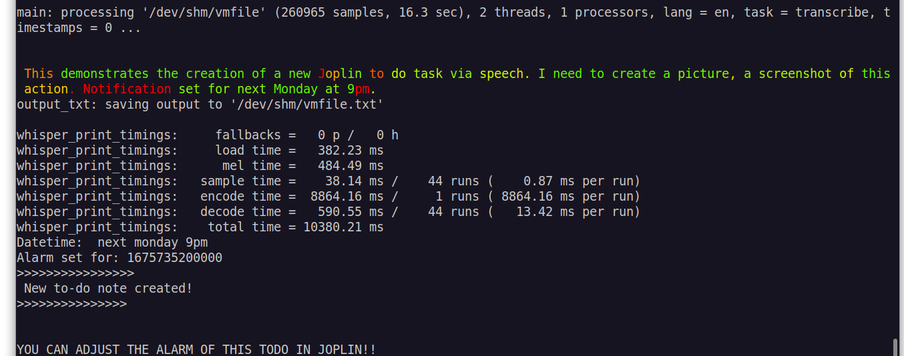
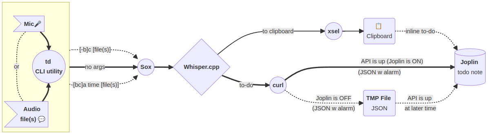
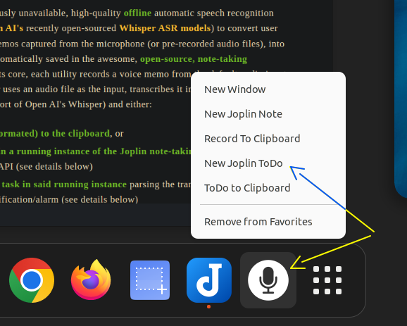
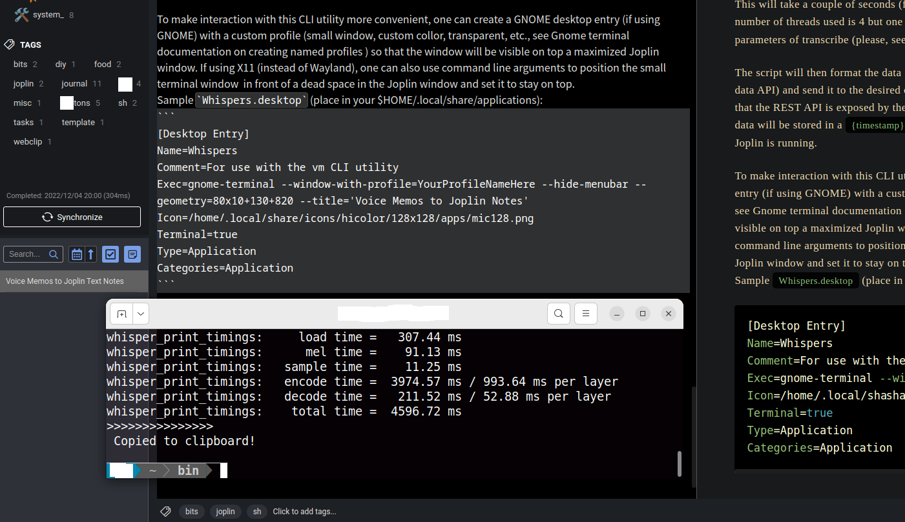

# *Joplin Text Notes and To-Dos via Speech*
##### *Voice memos recorded from the microphone, transcribed offline to text and converted to Joplin notes or To-Do tasks with automatic notifications. Can also transcribe from existing audio files.*
---
*(This repository expands on the older [NoteWhispers](https://github.com/QuantiusBenignus/NoteWhispers) by bringing new functionality, such as recording Joplin to-do tasks with alarms and the ability to handle multiple audio files)*




#### DESCRIPTION:  
These two Linux command-line utilities (with optional GNOME integration) are named respectively **vm** and **td** for brevity and quick access from the command line (check your PATH for conflicts and rename accordingly if needed.)

**vm** and **td** utilize previously unavailable, high-quality **offline** automatic speech recognition (ASR) technology (a derivative of [Open AI's](https://openai.com/) open-sourced [Whisper ASR models](https://github.com/openai/whisper)) to convert user speech, such as voice memos captured from the microphone (or pre-recorded audio files), into textual notes that are  automatically saved in the awesome, **open-source, note-taking application** [Joplin](https://joplinapp.org/). At its core, each utility records a voice memo from the default audio input channel (microphone) or uses one or multiple audio files as the input,  transcribes it into text using [whisper.cpp](https://github.com/ggerganov/whisper.cpp) (a C/C++ port of Open AI's Whisper) and either: 
   - **sends it (properly formated) to the clipboard**, or
   -  **creates a new note in a running instance of the Joplin note-taking app**  using Joplin's data API, or 
   -   **creates a new to-do task in the Joplin running instance** (in the case of **td**),  parsing the transcribed text for a valid datetime to set a notification/alarm (see details below)
   -   if Joplin is not running, **stores the note or to-do task in a file for later collection**.
   -   On a next invocation of either utility, if Joplin is up, **the temporarily stored notes / to-dos are collected** 
  


As CLI scripts relying on built-in Linux tools under the hood (plus a few optional but common utilities such as `sox` and `curl`), **vm**'s and **td**'s feature set is exposed by a few command line arguments:
#### SYNOPSIS:
`vm [-b|-c|-bc|-cb|-h|--help] ... [filenames]`
`td [-b|-c|-bc|-cb|-h|--help|-a datetimespec] ... [filename(s)]`

- `vm` the default: use the 'tiny' whisper.cpp ASR model file and create a note in Joplin 
- `td` the default: create a to-do note in Joplin 
- `vm -b|--base` transcribes to a Joplin note using the larger (more accurate but slower) 'base' model
- `td -b|--base` transcribes a to-do task using the 'base' model
- `vm -c|--clip` will transcribe and output to the clipboard
- `td -c|--clip` will also output to the clipboard but text formated as inline to-do task
- `td -a|--alarm datetimespec` will create a to-do task with alarm set to trigger on 'datetimespec'
- `vm -bc` or  `td -bc , td -cb , td -[cb]a datetimespec` etc. - valid compound options are acceptable
- `vm -h|--help`  or `td -h|--help` will print help info
- any and all non-option arguments are treated as input audio files to be converted
      * *(tested on Ubuntu 22.04 LTS under Gnome version 42.5, with the English language models )*
---
Please, note that these 2 command line utilities for **Linux** are written for *zsh* but a quick (and possibly dirty) translation to bash (see folder For_bash_users) is provided for users of *bash*, who should use those instead of the zsh originals.


#### PREPARING THE ENVIRONMENT

##### PREREQUISITES:
* Joplin Linux desktop installation with the WebClipper plugin enabled (see https://joplinapp.org/) 
*  Whisper.cpp installation (see https://github.com/ggerganov/whisper.cpp)
*  Recent versions of 'sox', 'curl', 'jq', 'xsel' command line utilities from your system's repositories.
*  A working microphone (in GNOME one can set a keyboard shortcut to turn it ON and OFF )
> *DISCLAIMER: Setting up the environment for this to work requires a bit of attention and, quite likely for the novice user, reading about the Linux internals and making informed choices. Some of the proposed actions, if implemented, will alter how your system works internally (e.g. systemwide temporary file storage and memory management). The author neither takes credit nor assumes any responsibility for any outcome that may or may not result from interacting with the contents of this document.*
##### CONFIGURATION
Inside each script, near the begining, there is a clearly marked section, named **"USER CONFIGURATION BLOCK"**, where all the user-configurable variables (described in the following section) have been collected. Some can be left as is but others will require to be set to the user-specific values as determined by the specific instance of Joplin.
##### Temporary directory and files
*(NB. Everything in this section is based on the author's choice and opinion and may not fit the taste or the particular situation of everyone; please, adjust the script as you like. )*

Audio-to-text transcription is memory- and CPU-intensive task and fast storage for read and write access can only help. That is why **vm** and **td** are designed to store temporary and resource files in memory, for speed and to reduce SSD/HDD "grinding": `TEMPD='/dev/shm'`. 
This mount point of type "tmpfs" is created in RAM (let's assume that you have enough, say, at least 8GB) and is made available by the kernel for user-space applications. When the computer is shut down it is automatically wiped out, which is fine since we do not need the intermediate files.
In fact, for Joplin and any other applications (Electron-based or not) that are stored in Appimage format, it would be beneficial (IMHO) to have the systemwide /tmp mount point also kept in RAM. Every time you start Joplin, it expands itself in /tmp writing about 500 MB to your SSD or HDD and moving /tmp to RAM may speed up application startup a bit. A welcome speedup for any Electron app.  In its simplest form, this transition is easy, just run:
`echo "tmpfs /tmp tmpfs rw,nosuid,nodev" | sudo tee -a /etc/fstab`
and then restart your Linux computer.
For the aforementioned reasons, the scripts also expect to find the ASR model files needed by whisper.cpp in the same location (/dev/shm). These are large files, that can be transferred to this location at the start of a terminal session (or at system startup). This can be done using your .zshrc (or .bashrc) file by placing something like this in it: 
```
([ -f /dev/shm/ggml-tiny.en.bin ] || cp /path/to/your/local/whisper.cpp/models/ggml* /dev/shm/)
```

#### "INSTALLATION"
*(Assuming whisper.cpp is available and the "main" executable compiled with 'make' in the cloned whisper.cpp repo. See Prerequisites section)*
* Place the scripts **vm** and **td**  (or, for bash users, the renamed **vm.bash** and **td.bash**) somewhere in your PATH. 
* Create a symbolic link (the code expects 'transcribe' in your PATH) to the compiled "main" executable in the whisper.cpp directory. For example, create it in your $HOME/bin> with 
```ln -s /full/path/to/whisper.cpp/main $HOME/bin/transcribe```.
* Edit your personal NOTEBOOK_ID and AUTH_TOKEN variables in the code using the values from your Joplin app (see next section).  

If you are using the GNOME integration (recommended), don't forget to:
* Place `Whispers.desktop` in `$HOME/.local/share/applications/
* Replace USERNAME and YOURPROFILENAME in the file with your values.
* Move the icon referenced in the .desktop file to the specified directory in $HOME/.local/...
* Find "Whispers" in your Activities and click "Add to Favorites" to pin it to the dock
* Create a new profile in gnome-terminal and edit it to suit your taste. Use its name in the .desktop file

##### Other environment variables

If Joplin is not running while the voice memo is being captured and transcribed, the scripts store transcribed notes or to-dos in the Joplin configuration directory for later processing (you can change this location as needed). This is in the code: `JOPLIND=$HOME'/.config/joplin-desktop/resources' `

The next two variables are for the Joplin data API. 
The first parameter is the id of the Joplin notebook where the new note will be created.
`NOTEBOOK_ID="PLACE_HERE_NOTEBOOK_ID_FROM_JOPLIN_RIGHT_CLICK_ON_NOTEBOOK_NAME"`
The second is the authentication token generated by the Web Clipper plugin in Joplin. (Make sure web clipper is installed, the token is needed to successfully interact with the REST API). 
`AUTH_TOKEN="PLACE_HERE_TOKEN_FROM_JOPLIN_TOOLS_OPTIONS_WEB_CLIPPER_ADVANCED_OPTIONS"`
(***Please, replace with your own values from the Joplin desktop app for Linux***)
##### Partial code listing of **td** (full scripts in **vm** and **td**):

```zsh
#!/usr/bin/zsh
# Needs some changes for users of bash, please, use instead the file located in the folder "For_bash_users" 

# MIT License

# Copyright (c) 2023 Quantius Benignus

# Permission is hereby granted, free of charge, to any person obtaining a copy
# of this software and associated documentation files (the "Software"), to deal
# in the Software without restriction, including without limitation the rights
# to use, copy, modify, merge, publish, distribute, sublicense, and/or sell
# copies of the Software, and to permit persons to whom the Software is
# furnished to do so, subject to the following conditions:

# The above copyright notice and this permission notice shall be included in all
# copies or substantial portions of the Software.

# THE SOFTWARE IS PROVIDED "AS IS", WITHOUT WARRANTY OF ANY KIND, EXPRESS OR
# IMPLIED, INCLUDING BUT NOT LIMITED TO THE WARRANTIES OF MERCHANTABILITY,
# FITNESS FOR A PARTICULAR PURPOSE AND NONINFRINGEMENT. IN NO EVENT SHALL THE
# AUTHORS OR COPYRIGHT HOLDERS BE LIABLE FOR ANY CLAIM, DAMAGES OR OTHER
# LIABILITY, WHETHER IN AN ACTION OF CONTRACT, TORT OR OTHERWISE, ARISING FROM,
# OUT OF OR IN CONNECTION WITH THE SOFTWARE OR THE USE OR OTHER DEALINGS IN THE
# SOFTWARE.
#--------------------------------------------------------------------------

# NAME: td (named for brevity and quick access, check your PATH for conflicts and rename accordingly if needed.) 

# PREREQUSITES: 
#      - Joplin desktop installation with WebClipper enabled (see https://joplinapp.org/)   
#      - whisper.cpp installation (see https://github.com/ggerganov/whisper.cpp) 
#      - recent versions of 'sox', 'curl', 'xsel', 'jq' command-line tools from your system's repositories.
#--------------------------------------------------------------------------

#Check dependencies
command -v sox &>/dev/null || { echo "sox is required. Please, install sox" >&2 ; exit 1 ; }
command -v curl &>/dev/null || { echo "curl is required. Please, install curl" >&2 ; exit 1 ; }
command -v xsel &>/dev/null || { echo "xsel is required. Please, install xsel" >&2 ; exit 1 ; }
command -v jq &>/dev/null || { echo "jq is required. Please, install jq" >&2 ; exit 1 ; }
command -v transcribe &>/dev/null || { echo -e "Please, install whisper.cpp (see https://github.com/ggerganov/whisper.cpp)\
\nand create 'transcribe' in your PATH as a symbolic link to the main executable, e.g.\n \
 'ln -s /full/path/to/whisper.cpp/main \$HOME/bin/transcribe'" >&2 ; exit 1 ; }
#Hear the complaints of the above tools:
set -e

#--------------------------------------------------------------------------
#USER CONFIGURATION BLOCK. 
#Please, adjust the variables here to suit your environment:

# Store temp files in memory for speed and to reduce SSD/HDD "grinding":
TEMPD='/dev/shm'
# Default whisper.cpp model file for inference:
model="$TEMPD/ggml-tiny.en.bin"
#If Joplin is not running, store transcribed notes in Joplin config. directory for later processing. 
JOPLIND=$HOME'/.config/joplin-desktop/resources'  #of course you can choose another place.
#[ -v $ramf ] || ramf="$(mktemp -p /dev/shm/ vmXXXX)"
# Hardcoded temp wav file to store the voice memo and get overwritten every time (in RAM):
ramf="$TEMPD/vmfile"

#Set the number of processing threads for whisper.cpp inference (adjust for your case):
NTHR=4
#It seems that the optimum number of transcribe threads should equal CPU processing cores:
#NTHR="$(( $(lscpu | awk '/^Socket\(s\)/{ print $2 }') * $(lscpu | awk '/^Core\(s\) per socket/{ print $4 }') ))"

# These are for the Joplin data API. 
# The first parameter is the id of the Joplin notebook where the new note/task will be created.
# The token is generated by the web clipper plugin in Joplin (REST data API server). 
# PLEASE, REPLACE WITH YOUR OWN FROM YOUR INSTANCE OF THE JOPLIN DESKTOP APP FOR LINUX:
NOTEBOOK_ID="7656dc8976987a9b6a99ac98b6d7f876"   # In my case the notebook is named VoiceMemos.
AUTH_TOKEN="675dc675b65a98af9875a3543af544c354a67c475a3cac7a57c467c6d76d4846d534dd978d798d787bd656a85765c87b765f78c6578a6"

#Finally, the trigger word to isolate the datetime block in the text for the to-do notification/alarm
keywrd="notification"   # pick a word that is pronounced clearly and is not too common. Run td -h to see examples of use.
 
#END OF USER CONFIGURATION BLOCK
#--------------------------------------------------------------------------

# Clipboard flag, when set the output goes to the clipboard (for insertion as inline to-do):
unset clip
# Is the Joplin data API up:
unset apiup


show_help() {
echo -e "\n   .~~~~~~~~~~~~~~~~~~~~~~~~~~~~~~~~~~~~~~~~~~~~~~~~~~~~~~~~~~~~~~~~~~~."
echo -e "   |  td - Create a Joplin to-do task and set notification via speech. |"
echo -e "   |    A showcase of the built-in power of the Linux command line.    |"
echo -e "   *~~~~~~~~~~~~~~~~~~~~~~~~~~~~~~~~~~~~~~~~~~~~~~~~~~~~~~~~~~~~~~~~~~~*\n"
echo " Records a voice memo from the microphone or usues audio file(s) as the input." 
echo " Transcribes each input (using whisper.cpp, a C/C++ port of OpenAI's Whisper engine) into text"
echo -e " formated as to-do task for the desktop version of the Joplin note-taking app and \n either:" 
echo "   - creates a new to-do note/task in a running instance of the Joplin app or"
echo "   - sends it to the clipboard for insertion in an existing Joplin note as inline to-do"
echo -e "   - if Joplin is not running, stores the transcription in a file for later collection\n" 

echo -e " SYNOPSIS: td [-b|-c|-bc|-cb|--help|-h|-a datetimespec] ... [filename(s)]\n"

echo "   - 'td' use the default 'tiny' whisper.cpp ASR model file and create a to-do note in Joplin" 
echo "   - 'td -h|--help' will print this text" 
echo "   - 'td -b|--base' transcribes to a Joplin to-do using the larger (more accurate but slower) 'base' model"
echo "   - 'td -c|--clip' will transcribe and send the text to the clipboard"
echo "   - 'td -a|--alarm datetimespec' will create a to-do task with alarm set to trigger on 'datetimespec'"
echo "   - 'td -bc' , 'td -cb' , 'td -[cb]a datetimespec' etc. - valid compound options are acceptable"
echo -e "   - any and all non-option arguments are treated as input audio files to be converted\n"

echo 'If explicit datetime is not supplied, the transcribed text is parsed for a valid notification/alarm datetime.'  
echo 'It is quite difficult for computers to parse our spoken time references and using only built-in tools'
echo '(i.e. date -d from coreutils) presents a huge challenge when parsing arbitrary datetime text.'
echo 'There are dedicated, complex NLP tools that work better but they are not perfect either.' 
echo -e 'A keyword set to the last "'"$keywrd"'" in the transcribed text is used to isolate the time reference:'
echo 'EXAMPLES: --------------------->'
echo '"Need to see my dentist next week. Set '"$keywrd"' for Tuesday"       - this is valid.'
echo '"Scheduled a company meeting with '"$keywrd"' for 2023/5/24 at 8pm"   - also OK.'
echo '"Besides each morning noitification, I also set one '"$keywrd"' for March the 3rd in the evening."  -OK'
echo '       ( "...'"$keywrd"' for next week"'
echo 'Also   | "...'"$keywrd"' in 3 hours"'
echo 'valid: { "...'"$keywrd"' tomorrow morning"  (see source code for "morning" & other adjustable definitions)'
echo '       | "...'"$keywrd"' in 33 hours and 5 minutes"'
echo '       ( "...'"$keywrd"' ninth month +1000 seconds"'
echo 'Custom:  "...'"$keywrd"' at the usual time" allows privacy and customization (see code for ideas)'
echo 'Speaking literaly "YYYY/MM/DD", followed by time (if needed) e.g. "2024 slash 5 slash 23 at 1pm" works well.'
echo 'As a minimum, the month should precede the date and time, e.g. "March 12" not "12 of March"'
echo 'In some edge cases, successful parsing gives incorrect datetime. Some practice needed to avoid those'
echo 'For scheduling critically-important stuff with this utility, use the command-line option "-a"' 
echo 'and provide explicit datetimespec or instead, simply set the to-do alarm time in Joplin.'
#    "(tested on Ubuntu 22.04 LTS under Gnome version 42.5 (Wayland and X11))"
exit 0 
}
#----- end of partial code listing
```
---
#### Notes
Sox is recording in wav format at 16k rate, the only currently accepted by whisper.cpp:
`rec -t wav $ramf rate 16k silence 1 0.1 3% 1 3.0 4% `
It will attempt to stop on silence of 2s with threshold of 6%, but you can always press CTRL-C to stop it manually. This is the only intervention that may be needed. 
After the memo is captured, it will be passed to `transcribe` (whisper.cpp) for speech recognition.
This will take a couple of seconds (fewer on a computer with fast CPU). One can adjust the number of processing threads used by adding  `-t n` to the command line parameters of transcribe (please, see whisper.cpp documentation). After transcription, the text is stored in a .txt file (-otxt argument in `transcribe -m $model -f $ramf -otxt`), in this case /dev/shm/vmfile.txt . 

The script will then format the data in the appropriate format (JSON for note creation via the data API) and send it to the desired output. If note creation was requested, a check will be made whether the REST API is exposed by the Web Clipper server (i.e. Joplin is running). If not, the JSON data will be stored in a `{timestamp}.json`  file to be picked up  on a later invocation of the script, when Joplin is running.

#### Parsing the transcribed text for a datetime reference (in **td** - to set up a to-do alarm)

>*(N.B. Only spoken English time constructs, operation in the user's current locale and time zone.)*

If explicit datetime is not supplied, the transcribed text is parsed for a valid notification/alarm datetime.
It is quite difficult for computers to parse our spoken time references and using only built-in tools (i.e. coreutils date -d) presents a huge challenge when parsing arbitrary datetime text.
There are dedicated, complex NLP tools that work better but they are not perfect either.

That is why, to make things a bit easier, a keyword is used to separate the note body from the date-time reference to be parsed. This keyword can be used in the note body freely, it is the last instance within the text that is considered as the separator. For example, if the keyword is **"notification"** (this is user-configurable), then the last "notification" in the transcribed text is used to isolate the time reference:
For example:
* *"Need to see my dentist next week. Set **notification** for Tuesday"*       - this is valid.
* *"Scheduled a company meeting with **notification** for 2023/5/24 at 8pm"*   - also OK.
* *"Guests need prior notification. Set one **notification** for March the 3rd in the evening."*  -OK
* *"...**notification** for next week"*
* *"...**notification** in 3 hours"*
* *"...**notification** tomorrow morning"*  (see source code for "morning" & other adjustable definitions)
* *"...**notification** in 33 hours and 5 minutes"*
* *"...**notification** on the ninth month +1000 seconds"*
... are all valid.
* or even *"...**notification** at the usual time"* for some extra customization (see code for ideas).

Speaking literaly "YYYY/MM/DD", followed by time (if needed) e.g. *"2024 slash 5 slash 23 at 1pm"* works well too.
As a minimum, the month should precede the date and time, e.g. "March 12" not "12 of March"
If parsing is unsuccessful, the utility will not set an alarm in Joplin and it has to be done manualy. A warning will be issued but the to-do task will be created successfully. The failure can be due to errors in the user instructions, errors in the speech recognition, limitations of the simplistic datetime preprocessor etc. With practice (and good diction:-) the error rate can be comparable to the error rate for speech recognition.
In some edge cases, successful parsing gives incorrect datetime. Some practice needed to avoid those
For scheduling critically-important stuff with this utility, use the command-line option "-a"
and provide explicit *datetime specification* or instead, simply set the to-do alarm time in Joplin.

#### Gnome desktop integration
To make interaction with this CLI utility more convenient, one can create a GNOME desktop entry (if using GNOME) with a custom profile for the terminal window (small window, custom color, transparent, etc., see `gnome-terminal` documentation on creating named profiles ) so that the window will be visible on top a maximized Joplin window. 
One can also choose whether to keep the terminal window open, or close it after the transcription (see the gnome-terminal settings for your custom profile - YOURPROFILENAME in the code below.)
Sample `SpokenNotes.desktop` (Replace USERNAME and YOURPROFILENAME and place in your ` $HOME/.local/share/applications/`):
```
[Desktop Entry]
Name=Spoken_Notes_To-Dos
Comment=For use with the vm and td CLI utilities
Exec=gnome-terminal --window-with-profile=YOURPROFILENAME --hide-menubar --geometry=64x6+380+920 --title=Speech-to-Joplin
Icon=/home/USERNAME/.local/share/icons/hicolor/128x128/apps/mic128.png
Terminal=true
Type=Application
Categories=Application
Actions=new-note;new-clip;new-todo;inline-todo;

[Desktop Action new-note]
Name=New Joplin Note
Exec=gnome-terminal --window-with-profile=Lilico --hide-menubar --geometry=64x6+380+920 --title=NewNote -- vm

[Desktop Action new-clip]
Name=Record To Clipboard
Exec=gnome-terminal --window-with-profile=Lilico --hide-menubar --geometry=64x6+380+920 --title=NewClip -- vm -c

[Desktop Action new-todo]
Name=New Joplin ToDo
Exec=gnome-terminal --window-with-profile=Lilico --hide-menubar --geometry=64x6+380+920 --title=NewTodo -- td

[Desktop Action inline-todo]
Name=ToDo to Clipboard
Exec=gnome-terminal --window-with-profile=Lilico --hide-menubar --geometry=64x6+380+920 --title=InlineTodo -- td -c

```
With the above `gnome-terminal` desktop entry ( please, adjust profile and username), the  utility will be accessible from the system dock, after you add it to your "Favorites" (right mouse click brings up the shown context menu):

>


The .desktop entry is set so that just clicking on the dock icon with the left mouse button will open the terminal and wait for a command (such as `td -ba "2023 March 23 23:00"`), while invoking one of the context menu commands will immediatlely start recording and will close the window when finished transcribing the note / to-do. The "tiny" ASR model file is used by default in the desktop menu actions but that can be changed as desired in the .desktop file by adding  the `-b` option to the respective command.

If using X11 (instead of the restrictive Wayland), one can use the `--geometry` command line argument to position the small terminal window  in front of a dead space in the Joplin window and set it to stay on top (screenshots):





Even with the default "tiny" model, the accuracy  (English language tested) is impressive and on a faster computer (not mine) it takes less than a second to transcribe a 30s audio clip with essentially no errors. As such, this command-line utility, combined with the power of [Whisper](https://github.com/openai/whisper) from Open AI (its [whisper.cpp](https://github.com/ggerganov/whisper.cpp) port, to be more precise), proves quite useful and practical, especially in the context of a note-taking app such as the versatile, customizable [Joplin](https://joplinapp.org/). Enjoy!

### Credits
* Open AI (for [Whisper](https://github.com/openai/whisper))
* Georgi Gerganov and community ( for Whisper's C/C++ port [whisper.cpp](https://github.com/ggerganov/whisper.cpp))
* Laurent Cozic and community (for the [Joplin](https://github.com/laurent22/joplin) note-taking app)
* The **curl** developer community (for the versatile and powerful **[curl](https://github.com/curl/curl)**)
* The **sox** developers (for the venerable "Swiss Army knife of sound processing tools")
* Stephen Dolan and community (for **jq**, *"the sed for JSON"*)
* The creators and maintainers of old and new utilities such as **xsel, xclip**, the heaviweight **ffmpeg** and others that make the Linux environment (CLI and GUI) such a powerful paradigm.

